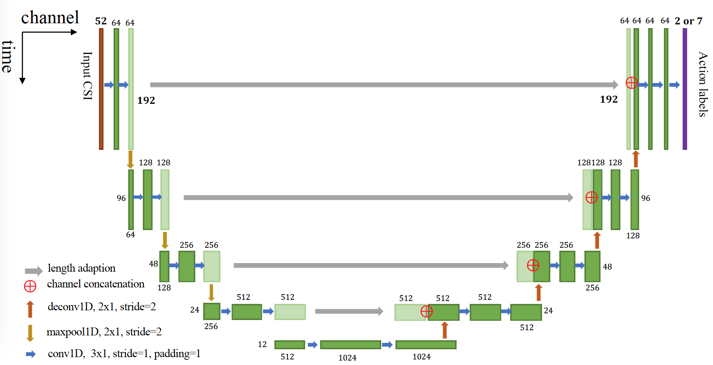
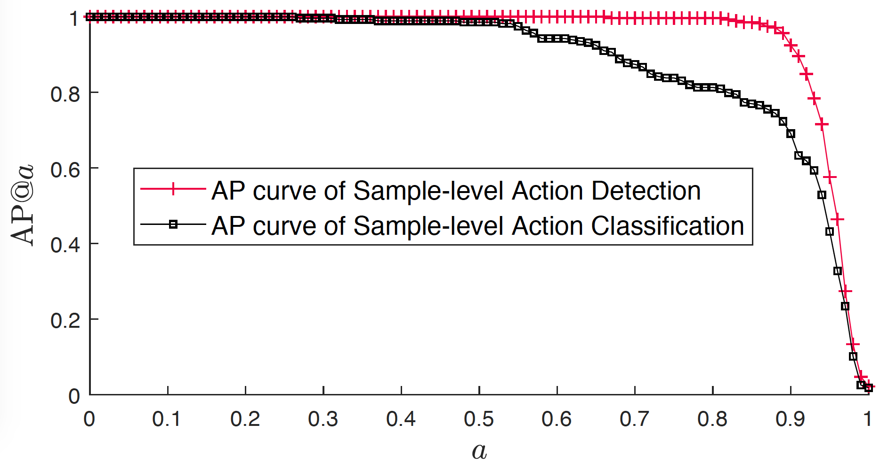
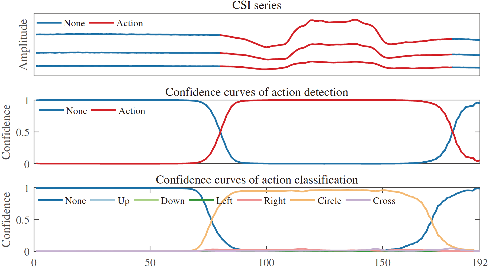

# Temporal Unet: Sample Level Action Recognition using WiFi

Data is [here](https://drive.google.com/open?id=1f2SrtotfBlWBrQIRRH-aM56cmJ2Tq9Iw), pre-trained model on action detection is [here](https://drive.google.com/open?id=1z4AEUkv5s9-d21xEJRF274qfkKIby6ts), and pre-trained model on action classification is [here](https://drive.google.com/open?id=1B3jZwoF5dmHCYGlwrf_LL2zSNY_pyzXL).

## Data description
### **train_data.mat**
1. train_data_amp: CSI amplitude of training data: 1116x52x192, 1116 CSI series, each series has 52 carriers, and 192 samples
2. train_label_instance: action labels, 1116x192, 1116 CSI series, each series and 192 samples which are labeld from 0 to 6 (background + 6 actions).
3. train_label_mask: action labels, 1116x192, 1116 CSI series, each series and 192 samples which are binaryly labeled.
4. train_label_time: start time and end time labels. 1116x2, 2 is for start and end.

### **test_data.mat**
similar to the above

## Network
Temporal operations including 1d convolutions, 1D maxpoolings, and 1D deconvolutions sweep along the time axis of CSI series.


## AP Curves



## An example



If this helps in your research, please kindly cite,  

```
@article{wang2019temporal,
  title={Temporal Unet: Sample Level Human Action Recognition using WiFi},
  author={Wang, Fei and Song, Yunpeng and Zhang, Jimuyang and Han, Jinsong and Huang, Dong},
  journal={arXiv preprint arXiv:1904.11953},
  year={2019}
}
```
